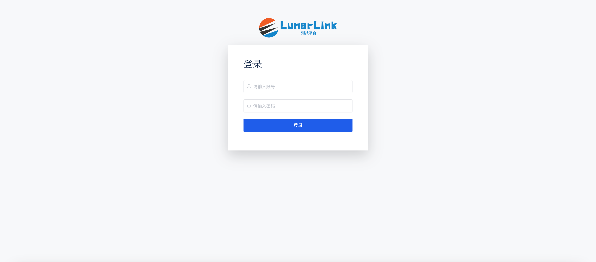
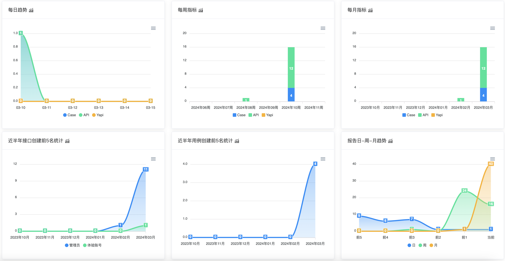
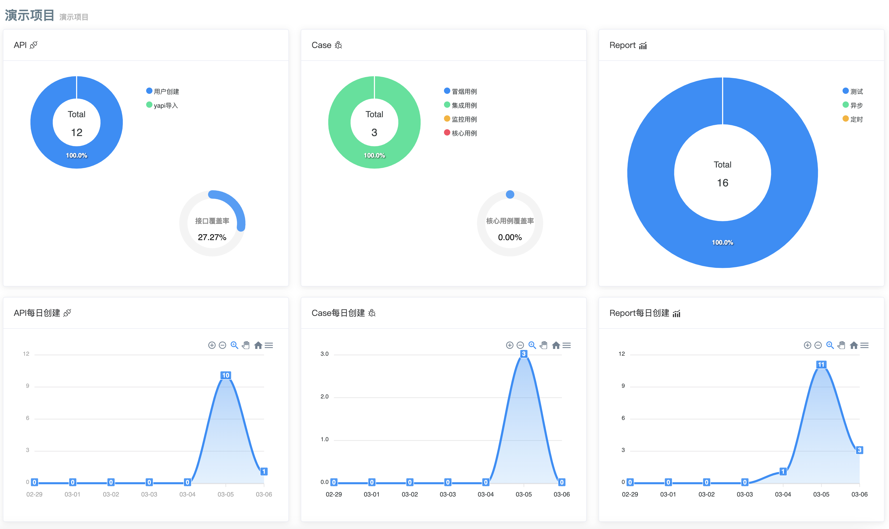
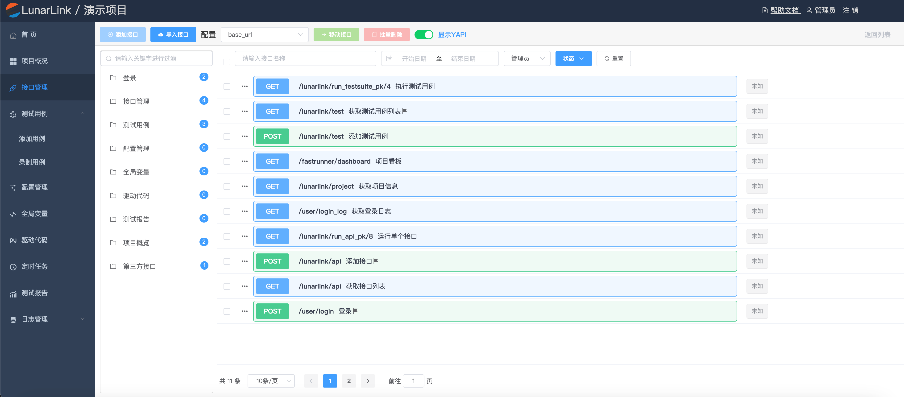

# LunarLink

[](https://python.org/) [](https://docs.djangoproject.com/zh-hans/3.2/) [](https://nodejs.org/zh-cn/)

## 平台简介

基于HttpRunner + Django + Vue + Element UI 的接口自动化测试平台，生产可用。

此外，非常感谢 [花菜](https://github.com/lihuacai168)。没有 AnotherFasterRunner 就不会有 LunarLink :)

## 技术栈

- [x]  🎨 Django
- [x]  🎶 Django Rest framework
- [x]  🎉 Vue.js
- [x]  🎃 Element UI
- [x] 🏐 django-celery-beat（定时任务）
- [x]  🎲 Nginx（反向代理，https配置等）
- [x] 👟 HttpRunner（测试用例执行引擎）
- [x]  🔒 RabbitMQ
- [x]  🚚 Redis
- [x]  💎 MySQL
- [x] ⛏ Docker

## 功能模块

- 登录：账号认证、用户管理、权限管理
- 项目管理：新增项目、列表展示及相关操作，支持项目看板，显示项目每日、每周、每月不同维度数据
- 项目概览：项目基本信息，API、测试用例、任务执行总览，每日明细
- API模板：一个API对应后端一个HTTP接口，API可以单独运行，也可以作为一个用例步骤，支持API分组、参数提取、数据断言、变量引用、前后置钩子函数、接口调试、日志显示
- 接口导入：支持同步YApi （以YApi 做媒介间接支持Swagger、Postman、Har），无需手动录入接口
- 测试用例：支持分组管理，由一个或多个API组成，支持关联接口的动态参数传递，不区分场景用例和单接口用例，支持同步、异步批量执行，生成测试报告
- 配置管理：自定义不同配置的请求base_url地址，公共请求头参数、局部变量、前后置钩子函数、参数化内容，API和用例可以选择不同配置执行
- 全局变量：定义变量供API使用，变量值也可以引用驱动代码中的函数，通用账号、秘钥可以定义在此处
- 驱动代码：支持Python脚本，定义前后置钩子函数、辅助函数可以轻松实现请求参数签名，加密和解密响应等功能
- 定时任务：可设置定时任务，遵循crontab表达式，可在线开启、关闭，用例执行支持串行、并行，完成后测试报告推送企业微信
- 历史报告：保存定时、调试、异步等不同类型的测试报告，可在线查看、筛选、删除，还可查看他人测试报告

## 在线体验

👩‍👧‍👦 生产地址：[http://47.119.28.171:8081](http://47.119.28.171:8081)

- 体验账号：test
- 密码：test2023

##  准备工作

```
Python >= 3.9.5 (推荐3.9.x版本)
nodejs >= 16.0 (推荐最新)
Mysql >= 5.7.0 (推荐5.7.x版本)
RabbitMQ >= 3.x-management(默认需要，推荐最新版)
Redis >= 6.2.6
```

##  前端 ♝

建议使用yarn，项目提供了`yarn.lock`，使用其他包管理器，容易出现版本依赖问题。

```bash
# 克隆项目
git clone https://github.com/tahitimoon/LunarLink.git

# 进入项目目录
cd LunarLink/frontend

# 安装依赖
yarn install --registry=https://registry.npmmirror.com

# 启动服务
yarn start
# 浏览器访问 http://127.0.0.1:8888
# config/index.js 文件可配置启动端口等参数
# config/dev.env.js 文件可配置后端接口地址
# config/prod.env.js 文件保持不变
# 构建生产环境
# yarn build
```

##  后端 💈

```bash
# 克隆项目
git https://github.com/tahitimoon/LunarLink.git

# 进入项目目录
cd LunarLink/backend

# 将.env.example文件重命名为.env 并配置相关参数
mv .env.example .env

# 安装依赖环境
pip3 install -r requirements.txt

# 执行迁移命令：
python3 manage.py makemigrations
python3 manage.py migrate

# 创建管理员用户
python3 manage.py createsuperuser

# 启动项目
python3 manage.py runserver
```

##  访问项目

```bash
浏览器打开:
http://127.0.0.1:8888
用户/密码:管理员用户/密码
接口文档地址:
http://127.0.0.1:8000/swagger/
```

## 开启定时/异步任务

```bash
# 启动celery，在控制台执行
celery -A backend worker -B --loglevel=info
```

##  演示图 ✅









##  Docker构建
请参考文档[Docker构建](deployment/README.md)
